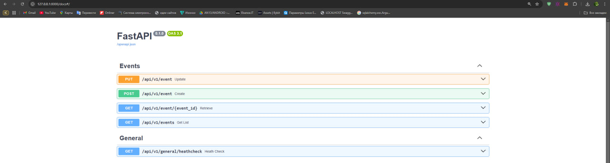

# Line-provider

# In addition to this service, there is a **[bet-maker](https://github.com/MaxShpud/bet-maker)**. 

## Overview

Go-to source for real-time, up-to-the-minute information on a wide array of events, all tailored to help you make smarter bets.

## Stack

- Python 3.10
- FastAPI
- Pydantic
- SQLAlchemy
- PostgreSQL
- Redis

## Architecture 
Using a clean architecture. Container, Repository, and UOW patterns.
## Installation and Setup

### Prerequisites

Before you can run the Bilinz User Management Service, ensure that you have the following prerequisites installed:

- Docker
- Docker Compose

### Getting Started

1. Clone the repository to your local machine.

```bash
git clone git@github.com:MaxShpud/line-provider.git
cd line-provider
```

2. Build and start the application using Docker Compose. Run the following command to build the Docker images and start the services (backend, PostgreSQL, Redis) defined in the docker-compose.yml file:
```bash
docker-compose up --build
```
Docker Compose Services:
- bet-maker-backend: The backend service running the FastAPI app.
      - Accessible on port 8000.
      - Uses the Dockerfile in the project root to build the image.
      - Runs alembic upgrade head to apply any database migrations before starting the FastAPI server.
      - Depends on the PostgreSQL service.

- postgresql: The PostgreSQL service for the backend database.
      - Accessible on port 5433 on the host machine.
      - Uses the official postgres:16.2 image.
      - Environment variables such as POSTGRES_USER, POSTGRES_PASSWORD, and PGDATA are configured in the .env file.


### Running the Application

Once the services are up, you can access the Bet-maker backend via:
- http://localhost:8001 for the FastAPI application.

You can also interact with PostgreSQL:
- PostgreSQL: Connect to localhost:5433 using the configured credentials.

### Stopping the Services
To stop the services, run:
```bash
docker-compose down
```
This will stop and remove the containers, but it will not delete the volumes or network. If you want to clean everything up (including volumes), use:
```bash
docker-compose down -v
```

### API Documentation

Once the service is running, you can access the API documentation at `http://localhost:8001/docs` to explore and interact with the available endpoints.



### How the service works:
1) GET/api/v1/events allows you to get all the events from the database.
2) GET/api/v1/event/{event_id} allows you to receive an event by its uuid
3) POST/api/v1/event allows you to create an event 
 - status can only be UNFINISHED, WON, LOST
 - type can only be NONE, SPORT, CYBERSPORT
 - if the value for the deadline field of the current time is set, the event will not be created, because it is considered completed.
4) PUT/api/v1/event allows you to update the event
 - if the status of unequal UNFINISHED is established, it is assumed that the event can be considered completed.
 - When updating, the value of the status field is checked against the existing value in the database. 
If they match, nothing happens and the redis data is simply updated (we do not make a request in the Line-provider, because only the id and status fields are used in the line-provider).
If the values do not match, then we make a request to the line-provider service for the PUT/bet endpoint and update the value.
6) GET/api/v1/general/heathcheck checking the application status

### WORKFLOW FOR TESTING BOTH SERVICES
## STEPS:
1) Line-provider: POST/api/v1/event - to create an event
2) Line-provider: GET/api/v1/events - to view events
3) Bet-maker: GET/events - to view events that are in Redis (consider relevant)
4) Bet-maker: POST/bet - to create a bet
5) Bet-maker: GET/bets - to view events (can use filter by status field)
6) Line-provider: PUT/api/v1/event - change the status of the event to completed (simulating the end of the event)
7) Bet-maker: GET/events - to view events that are in Redis (consider relevant)
8) Bet-maker: GET/bets or GET/bet/{bet_id) - to see that the status of the bid has changed

### What can be improved:
1) Using workers to complete deferred tasks (when the deadline arrives). 
2) Availability of more checks. 
3) Availability of more tests.